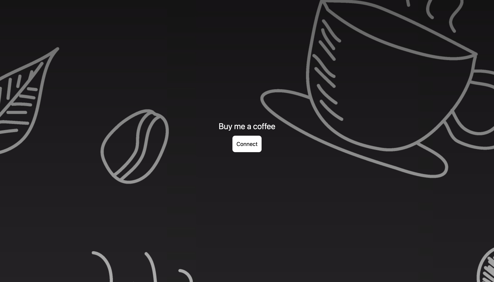
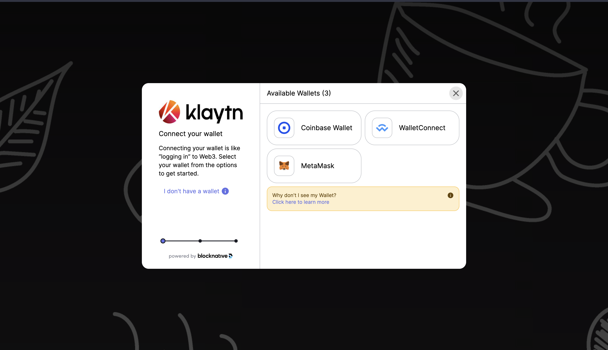
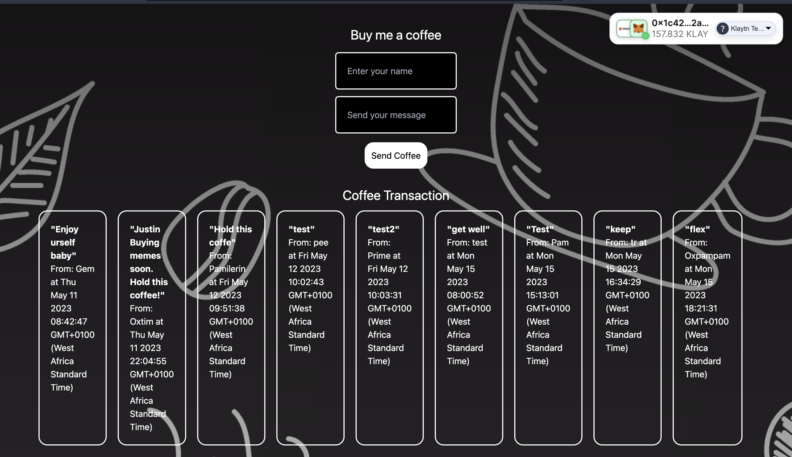

# 5. Building the BMC Frontend with React and Web3Onboard <a id="builidng-bmc-frontend-with-react-and-web3onboard"></a>

In this section, we will be building our dApp frontend website with Next.js and Web3Onbaord. To get started, you have to navigate to the frontend folder previously created.

```bash
cd ..
cd frontend 
```
The next step is to install the necessary dependencies to get our BMC frontend website up and running.  The following are the packages to be installed:

1. Web3Onboard packages: Web3-Onboard is a chain-agnostic wallet library that supports multi-wallet compatibility in your dApp built on EVM-compatible networks like Klaytn Blockchain.
2. ethers.js: Web3-Onboard provider can be used with libraries like [ethers.js](https://docs.ethers.org/v6/) and[web3.js](https://web3js.readthedocs.io/en/v1.2.8/getting-started.html). In this guide, we will use ethers.js to make Klaytn blockchain calls like getting the user's account, fetch balance, sign transaction, send transaction, read from and write to the smart contract.

Important Note: We need to edit 2 files in the  frontend/pages folder
- **_app.js**
- **index.js**

## 5.1 Setting up Web3Onboard Provider and Wallet Modules <a id="setting-up-web3onboard-provider-and-wallet-modules"></a>

### Step 1 - Installing @web3-onboard/react

```bash
npm install @web3-onboard/react
```
In your `_app.js` file, import the web3OnboardProvider and init function. More to be discussed later.

```js
import { Web3OnboardProvider, init } from '@web3-onboard/react'
```

### Step 2 - Installing and Instantiating Wallet Modules
In this step, you can add as many wallets to be supported in your dApp using the wallet modules. But for this guide, you will add Coinbase Wallet, WalletConnect, Injected Wallets to your web3-Onboard implementation.

```bash
npm install @web3-onboard/coinbase // Coinbase Wallet
npm install @web3-onboard/walletconnect // WalletConnect
npm install @web3-onboard/injected-wallets  // Used to connect to Metamask
```
In your `_app.js` file, import and instantiate the wallet modules to integrate with your dApp. Note that each module has its own unique options parameters to pass in, such as a fallback JSON RPC URL or default chain ID.

```js
import coinbaseWalletModule from "@web3-onboard/coinbase";
import walletConnectModule from "@web3-onboard/walletconnect";
import injectedModule from "@web3-onboard/injected-wallets";
const coinbaseWalletSdk = coinbaseWalletModule();
const walletConnect = walletConnectModule();
const injected = injectedModule();
const modules = [coinbaseWalletSdk, walletConnect, injected];
```
### Step 3 - Installing ethers

```bash
npm install --save ethers
```
### Step 4 - Instantiating Web3Onboard using the Web3OnboardProvider

Web3OnboardProvider provides a better way to manage global state. It simplifies wrapping the provider object around your App and the initialized Web3Onboard instance will be available in all children components.

Init function initializes web3-Onboard and makes it available for all hooks to use.

To see this in action, paste the code below the previous code in your `_app.js`file:

```js
const ETH_MAINNET_RPC_URL = `https://ethereum-mainnet-rpc.allthatnode.com/1d322388ZEPI2cs0OHloJ6seI4Wfy36N`;
const KLAYTN_MAINNET_URL = `https://klaytn-mainnet-rpc.allthatnode.com:8551/1d322388ZEPI2cs0OHloJ6seI4Wfy36N`;
const KLAYTN_BAOBAB_URL = `https://klaytn-baobab-rpc.allthatnode.com:8551/1d322388ZEPI2cs0OHloJ6seI4Wfy36N`;
  const web3Onboard =  init({
    wallets: modules,
    chains: [
      {
        id: "0x1", // chain ID must be in hexadecimal
        token: "ETH",
        namespace: "evm",
        label: "Ethereum Mainnet",
        rpcUrl: ETH_MAINNET_RPC_URL
      },
      {
        id: "0x2019", // chain ID must be in hexadecimal
        token: "KLAY",
        namespace: "evm",
        label: "Klaytn Mainnet",
        rpcUrl: KLAYTN_MAINNET_URL
      },
      {
        id: "0x3e9", // chain ID must be in hexadecimel
        token: "KLAY",
        namespace: "evm",
        label: "Klaytn Testnet",
        rpcUrl: KLAYTN_BAOBAB_URL
      },
     // you can add as much supported chains as possible
    ],
    appMetadata: {
      name: "Klaytn-web3-onboard-App", // change to your dApp name
      icon: "paste your icon url"
      logo: "paste your logo url"
      description: "Web3Onboard-Klaytn",
      recommendedInjectedWallets: [
        { name: "Coinbase", url: "https://wallet.coinbase.com/" },
        { name: "MetaMask", url: "https://metamask.io" }
      ]
    }
  })
export default function App({ Component, pageProps }) {
  return (
    <Web3OnboardProvider web3Onboard={web3Onboard}>
      <Component {...pageProps} />
    </Web3OnboardProvider>
 )
}
```

Having set up our _app.js file which grants our  App a provider object  and  web3Onboard instance available in all children components, next is to build out front-end logic in our `index.js` file

- Index.js

This page handles wallet connection and sending of coffee to the BMC smart contract which is to be withdrawn by the contract deployer.

```js
import React, { useEffect, useState } from 'react';
import { useConnectWallet } from '@web3-onboard/react'
import abi from "../utils/BuyMeACoffee.json"
import { ethers } from "ethers";

export default function Home() {
  const [name, setName] = useState("");
  const [message, setMessage] = useState("");
  const [coffee, setGetCoffee] = useState([]);
  const [coffeeContract, setCoffeeContract] = useState();
  const [{ wallet, connecting }, connect, disconnect] = useConnectWallet();
  const contractAddress = "Paste BMC contract address";
  const contractABI = abi.abi;
  const getCoffee = async () => {
    try {
       console.log("getting coffee Id")
       const coffeeId = await coffeeContract.coffeeId();
       console.log(coffeeId.toString());
       const getCoffee = await coffeeContract.getAllCoffee(coffeeId.toString());
       setGetCoffee(getCoffee);
    } catch (error) {
      console.log(error);
    }
  };
  useEffect(() => {
    let ethersProvider
    if (wallet) {
       ethersProvider = new ethers.BrowserProvider(wallet.provider, 'any')
    }


    if (ethersProvider) {
      try {
        const getCoffeContract = async () => {
          const signer =  await ethersProvider.getSigner();

          const buyMeACoffee = new ethers.Contract(contractAddress, contractABI, signer);

          setCoffeeContract(buyMeACoffee)
        }
        getCoffeContract();
      } catch (error) {
        console.log(error);
      }
    }
  }, [wallet])
  useEffect(() => {
    const onNewCoffee = (from, timestamp, name, message) => {
      console.log("Coffee received: ", from, timestamp, name, message);
      setGetCoffee((prevState) => [
        ...prevState,
        {
          address: from,
          timestamp: new Date(timestamp * 1000),
          message,
          name
        }
      ]);
    };
      if (wallet && coffeeContract) {
        getCoffee()
        coffeeContract.on("NewCoffee", onNewCoffee);    
      } else {
        console.log("provider not initialized yet");
      }
  }, [wallet, coffeeContract])
  const onNameChange = (event) => {
    setName(event.target.value);
  }
  const onMessageChange = (event) => {
    setMessage(event.target.value);
  }
  const buyCoffee = async (e) => {
    e.preventDefault();
    try {
      if (!wallet && !coffeeContract) {
        console.log("provider not initialized yet");
        return;
      }
        console.log("buying coffee..")
        const coffeeTxn = await coffeeContract.buyCoffee(name, message, {value: ethers.parseEther("1.0")});
        const coffeTx =  await coffeeTxn.wait();
        console.log("mined ", coffeTx.hash);
        console.log("coffee sent!");
        // clear target value fields
        e.target.inputName.value = "";
        e.target.inputAmount.value = "";
        // Clear the form fields.
        setName("");
        setMessage("");
        // set all coffees
        await getCoffee();
    } catch (error) {
      console.log(error);
    }
  };

  return (
     <main className='coffeeMain max-w-8xl min-h-[100vh] p-10 bg-black mt-0 shadow-2xl m-auto flex flex-col justify-center items-center bg-[url("https://static.vecteezy.com/system/resources/previews/001/330/185/original/coffee-cup-on-hand-drawn-doodle-background-free-vector.jpg")]'>
        <div className='coffeContent'>
          <div className='compOne flex flex-col justify-center items-center'>
            <h1 className='text-white text-center text-2xl'>Buy me a coffee</h1>
            { wallet ?
            ( <div>
                <form onSubmit={buyCoffee} className="flex flex-col justify-center items-center mt-4">
                  <input type="text" name='inputName' placeholder="Enter your name" className="p-5 rounded-md bg-black text-white border-solid border-2 border-white outline-0" onChange={onNameChange} />
                  <input type="text" name='inputAmount' placeholder="Send your message" className="p-5 rounded-md bg-black text-white border-solid border-2 border-white mt-3 outline-0" onChange={onMessageChange}/>
                  <input type="submit" value="Send Coffee" className="p-3 mt-4 rounded-2xl bg-white text-black cursor-pointer"/>
                </form>
            </div> ) : (    <button className='text-black bg-white p-3 rounded-lg mt-3 cursor-pointer' disabled={connecting} onClick={() => (wallet ? disconnect(wallet) : connect())}>
        {connecting ? 'Connecting' : wallet ? 'Disconnect' : 'Connect'}
      </button>)

            }
          </div>
          <div className="comp2 flex flex-col justify-normal items-center py-3 px-10">
            {wallet && ( 
              <div className="flex mt-5 mb-3">
                  <h1 className="text-white text-2xl">Coffee Transaction</h1>
              </div>
              ) }
              <div className="coffeeTransaction w-[1300px] flex flex-row gap-5 overflow-x-scroll">
              {/* grid gap-4 grid-cols-2 */}
                {wallet && (coffee.map((coff, id) => {
                      return (
                        <div key={id} className=" border-solid border-2 border-white p-5 w-auto rounded-2xl mb-3">
                          <p className=" text-white font-bold">"{coff.message}"</p>
                          <p className=" text-white">From: {coff.name} at {`${new Date(coff.timestamp.toString() * 1000)}`}</p>
                        </div>
                      )
                }))}
              </div>
            </div>
        </div>
    </main>
  )
}
```

## Important notes from the code above
1. Get your contract ABI:  The contract ABI specifies to the frontend code what functions are available to call on the smart contract. To get your contract abi, navigate to your smart-contract folder and copy the text  in this file following this path **artifacts/contracts/BuyMeACoffee.sol/BuyMeACoffee.json**.  Next we created a utils folder in the **frontend/src** folder. Then pasted it in a newly created file named BuyMeACoffee.json file.

2. Change BMC Contract address to the address of your BMC deployed contract.

Now if the app isn't already running, you can go to the shell and use `npm run dev` to start a local server to test out your changes. The website should load in a few seconds and UI should look like this:

Connect Wallet Page:






Frontend website to send coffee:



Now let's explore through our website and the code.

You can already see from the above screenshot that when you first visit the dApp, it will ask you to connect a wallet.  Next it pops up the list of available wallets initialized in the Web3Onboard instance.

Then you select the wallet of your choice; from the image above, we selected MetaMask. Once you have connected your wallet, you get to see a UI component on the upper right of your website which contains the details of the connected wallet. Also on the page, you will  see the coffee transaction form which contains the name and message of the sender, as well as the previous coffee paid into the smart contract by other visitors. 


