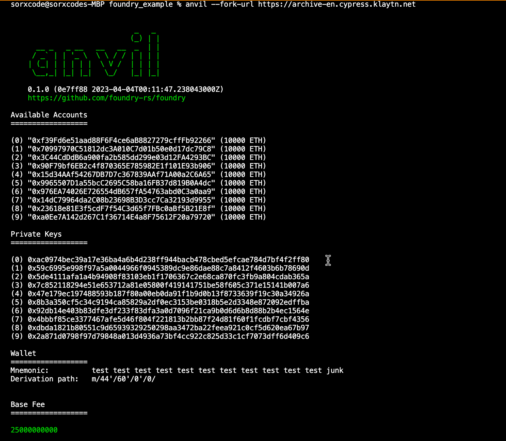
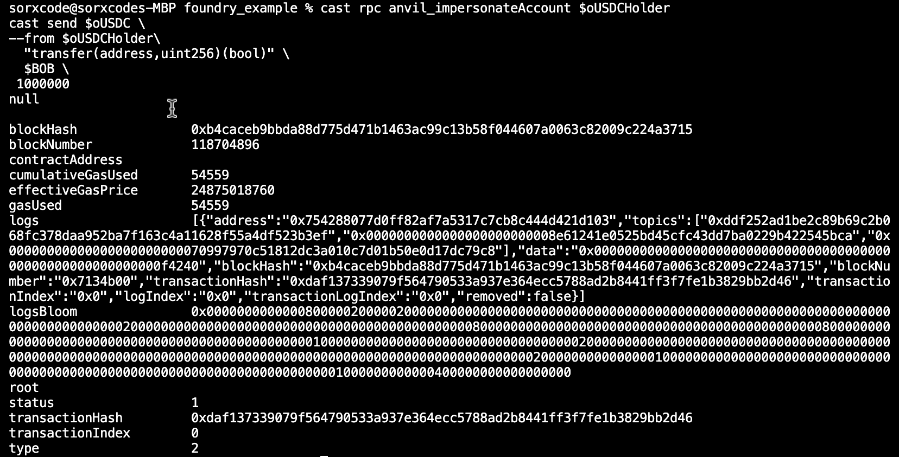

# Introduction
Foundry는 Rust로 작성된 스마트 컨트랙트 개발 프레임워크로, 개발자들이 계약을 관리하고 컴파일하고, 테스트를 실행하고, 계약을 배포하며, 커맨드 라인을 통해 솔리디티 스크립트로 네트워크와 상호 작용할 수 있게 해줍니다.

Foundry는 다음과 같이 네 가지 주요 CLI 도구로 구성되어 있으며, 이를 통해 빠르고 모듈식 스마트 계약 개발이 가능합니다:

* [Forge](https://github.com/foundry-rs/foundry/tree/master/forge): Forge를 사용하여 스마트 컨트랙트를 배포하고, 테스트하고, 컴파일할 수 있습니다.
* [Cast](https://github.com/foundry-rs/foundry/tree/master/cast): Cast는 EVM 스마트 컨트랙트와 상호 작용하는 것을 간단하게 만들었습니다. Cast는 체인 데이터를 얻는 것, 트랜잭션을 보내는 것과 그 외의 것들도 포함합니다.
* [Anvil](https://github.com/foundry-rs/foundry/tree/master/anvil): 로컬 노드를 구동해야 하나요? Anvil은 Foundry에서 제공하는 로컬 노드 환경입니다.
* [Chisel](https://github.com/foundry-rs/foundry/blob/master/chisel): 빠르고 유용하며 자세한 솔리디티 REPL입니다.

여러분은 가이드를 통해서 아래 사항을 진행할 수 있습니다:
* 간단한 Foundry 프로젝트를 생성합니다.
* Foundry를 사용하여 샘플 스마트 컨트랙트를 컴파일하고 테스트합니다.
* Foundry를 사용하여 Klaytn Baobab 네트워크에 스마트 컨트랙트를 배포합니다.
* Cast와 Anvil을 사용하여 메인넷을 포크하는 방법을 탐색합니다.

# Pre-requisites
아래 내용은 튜토리얼을 따르기 위한 필수 요구 사항입니다:

* 코드 에디터: [VS-Code](https://code.visualstudio.com/download)와 같은 소스 코드 에디터
* [MetaMask](https://docs.klaytn.foundation/dapp/tutorials/connecting-metamask#install-metamask): 컨트랙트를 배포하고, 트랜잭션에 서명하고, 컨트랙트와 상호 작용하는 데 사용됩니다.
* RPC Endpoint: 지원되는 [Endpoint Providers](https://docs.klaytn.foundation/content/dapp/json-rpc/public-en) 중 하나에서 이를 얻을 수 있습니다.
* [Faucet](https://baobab.wallet.klaytn.foundation/faucet)에서 테스트 KLAY 받기: 충분한 KLAY로 계정에 자금을 입금합니다.
* [Rust](https://www.rust-lang.org/tools/install)와 [Foundry](https://github.com/foundry-rs/foundry#installation)를 설치합니다.

# Setting Up Your Development Environment
Foundry 설치가 성공적인지 확인하려면 아래 명령어를 실행하세요:

```bash
forge -V
```
**Output**


Foundry를 성공적으로 설치한 후, 이제 foundry에서 사용 가능한 CLI 도구 (forge, cast, anvil, chisel)에 접근할 수 있습니다. 다음 단계로 foundry 프로젝트를 설정해봅시다:

**1 단계**: 새 프로젝트를 시작하려면 아래 명령어를 실행하세요:

```bash
forge init foundry_example 
```
**2 단계**: 프로젝트 폴더로 이동하세요.

```bash 
cd foundry_example
ls   
```
Foundry 프로젝트를 초기화한 후, 현재 디렉토리에는 아래 내용이 포함되어야 합니다:
* **src**: 스마트 컨트랙트를 위한 기본 디렉토리입니다.
* **tests**: 테스트를 위한 기본 디렉토리입니다.
* **foundry.toml**: 기본 프로젝트 구성 파일입니다.
* **lib**: 프로젝트 종속성을 위한 기본 디렉토리입니다.
* **script**: Solidity 스크립팅 파일을 위한 기본 디렉토리입니다.

# 스마트 컨트랙트의 예시
이번 장에서는 초기화된 Foundry 프로젝트에서 샘플 카운터 컨트랙트를 사용할 것입니다. `src/` 폴더 안의 `counter.sol` 파일은 다음과 같아야 합니다:

```solidity
// SPDX-License-Identifier: UNLICENSED
pragma solidity ^0.8.13;
contract Counter {
    uint256 public number;
    function setNumber(uint256 newNumber) public {
        number = newNumber;
    }
    function increment() public {
        number++;
    }
}
```
**코드 설명**

이것이 여러분이 작성한 스마트 컨트랙트입니다. **1행**은 솔리디티 버전 0.8.13 이상을 사용함을 보여줍니다. **4행에서 12행**까지, `Counter`라는 스마트 컨트랙트가 생성됩니다. 이 컨트랙트는 단순히 **setNumber** 함수를 사용하여 새 숫자를 저장하고, **increment** 함수를 호출하여 그 숫자를 증가시킵니다.

# Testing smart contract
Foundry는 다른 스마트 컨트랙트 개발 프레임워크에서 자바스크립트로 테스트를 작성하는 것과 달리, 솔리디티로 테스트를 작성할 수 있게 해줍니다. 우리가 초기화한 Foundry 프로젝트에서, `test/Counter.t.sol`은 솔리디티로 작성된 테스트의 예시입니다. 코드는 다음과 같습니다:

```solidity
// SPDX-License-Identifier: UNLICENSED
pragma solidity ^0.8.13;
import "forge-std/Test.sol";
import "../src/Counter.sol";
contract CounterTest is Test {
    Counter public counter;
    function setUp() public {
        counter = new Counter();
        counter.setNumber(0);
    }
    function testIncrement() public {
        counter.increment();
        assertEq(counter.number(), 1);
    }
    function testSetNumber(uint256 x) public {
        counter.setNumber(x);
        assertEq(counter.number(), x);
    }
}
```
위의 코드는 forge의 표준 라이브러리와 Counter.sol을 가져왔음을 보여줍니다.

위의 테스트들은 아래 내용을 확인합니다:
* 숫자가 증가하고 있나요?
* 숫자가 설정된 숫자와 같나요?

테스트가 잘 작동하는지 확인하려면 다음 명령어를 실행하세요:

```bash
forge test
```
**Output**


테스트 작성, 고급 테스팅 및 기타 기능에 대해 자세히 알고 싶다면, [Foundry의 문서](https://book.getfoundry.sh/forge/tests)를 참조하세요.

# 스마트 컨트랙트 컨트랙트 컴파일하기
아래 명령어를 통해 여러분의 컨트랙트를 컴파일하세요:

```bash
forge build 
```

# 스마트 컨트랙트 배포하기

Foundry를 사용하여 컨트랙트를 배포하려면, 계약을 배포할 계정의 RPC URL과 개인 키를 제공해야 합니다. Klaytn의 [rpc-provider](https://docs.klaytn.foundation/content/dapp/json-rpc/public-en) 목록을 확인하여 rpc-url을 찾고, [MetaMask](https://docs.klaytn.foundation/dapp/tutorials/connecting-metamask#install-metamask)를 사용하여 계정을 생성하세요.

**1단계**: Klaytn Baobab 네트워크에 계약을 배포하려면 아래의 명령어를 실행하세요:

```bash
$ forge create --rpc-url <your_rpc_url> --private-key <your_private_key> src/Counter.sol:Counter
```

**예시**

```bash
forge create --rpc-url https://klaytn-baobab-rpc.allthatnode.com:8551/qtKkeUE8ZEPI2cs0OHloJ6seI4Wfy36N --private-key hhdhdhdhprivatekeyhdhdhdhud src/Counter.sol:Counter
```

**주의 사항: private key 인수를 MetaMask에서의 귀하의 개인 키로 교체하세요. 개인 키를 노출하지 않도록 매우 주의하세요.**

**Output**


**2단계**: 카운터 컨트랙트가 성공적으로 배포되었는지 확인하기 위해 [Klaytnscope](https://baobab.scope.klaytn.com/tx/0x669e39c9661fdab59aa34989b58b3f89376a93f846a0c71d2858918f58a307e2?tabId=internalTx)를 엽니다.

**3단계**: 검색 필드에 트랜잭션 해시를 복사하여 붙여넣고 Enter 키를 누릅니다. 정상적으로 작동했다면, 최근에 배포된 계약을 볼 수 있어야 합니다.


# 컨트랙트와 상호작용

스마트 컨트랙트를 성공적으로 배포한 후에는 함수를 호출하고 실행하길 원하게 될 것입니다. Klaytn Baobab 네트워크에서 배포된 컨트랙트와 상호 작용해 보겠습니다. [Cast](https://book.getfoundry.sh/reference/cast/cast-send.html)를 사용하면 됩니다.  이번 장에서는 `read-only` 함수를 실행하기 위해 [cast call](https://book.getfoundry.sh/reference/cast/cast-call)을 사용하는 방법과 `write` 함수를 실행하기 위해 [cast send](https://book.getfoundry.sh/reference/cast/cast-send)를 사용하는 방법을 배우게 될 것입니다.

**1. cast call**: 계약에 저장된 숫자를 가져오려면 `number` 함수를 호출해야 합니다. 실제로 작동하는 것을 보시려면, 아래의 명령어를 실행하세요.

```bash
cast call YOUR_CONTRACT_ADDRESS "number()" --rpc-url RPC-API-ENDPOINT-HERE
```
**예시**

```bash
cast call 0xe4d576c447733da7ca9197e88d34a74c3c865cff "number()" --rpc-url https://klaytn-baobab-rpc.allthatnode.com:8551/qtKkeUE8ZEPI2cs0OHloJ6seI4Wfy36N
```

**Output**


데이터를 16진수 형식으로 받아야 합니다:

```bash
0x0000000000000000000000000000000000000000000000000000000000000000
```
그러나 원하는 결과를 얻으려면 위의 결과를 변환하기 위해 cast를 사용하세요. 이 경우, 데이터는 숫자이므로 이를 10진수로 변환하여 결과 0을 얻을 수 있습니다:

```bash
cast --to-base 0x0000000000000000000000000000000000000000000000000000000000000000 10
```
**Output**


**2. cast send**: 카운터 컨트랙트에서 `setNumber` 함수와 같은 트랜잭션을 실행하여 서명하고 발행하려면 아래의 명령어를 실행하세요:

```bash
cast send --rpc-url=<RPC-URL> <CONTRACT-ADDRESS> “setNumber(uint256)” arg --private-key=<PRIVATE-KEY>
```
**예시**

```bash
cast send --rpc-url=https://klaytn-baobab-rpc.allthatnode.com:8551/qtKkeUE8ZEPI2cs0OHloJ6seI4Wfy36N  0xe4d576c447733da7ca9197e88d34a74c3c865cff "setNumber(uint256)"  10 --private-key=<private key>
```
**Output**


**번호 교차 확인**

```bash
cast call 0xe4d576c447733da7ca9197e88d34a74c3c865cff "number()" --rpc-url https://klaytn-baobab-rpc.allthatnode.com:8551/qtKkeUE8ZEPI2cs0OHloJ6seI4Wfy36N
```

**Output**


이 데이터를 16진수 형식으로 받아야 합니다:

```bash
0x000000000000000000000000000000000000000000000000000000000000000a
```
원하는 결과를 얻으려면 위의 결과를 변환하기 위해 cast를 사용해야합니다. 이 경우, 데이터는 숫자이므로 이를 10진수로 변환하여 결과 10을 얻을 수 있습니다:

```bash
cast --to-base 0x000000000000000000000000000000000000000000000000000000000000000a 10
```
**Output**


# Cast와 Anvil로 메인넷 포크하기
Foundry는 메인넷을 로컬 개발 네트워크 ([Anvil](https://book.getfoundry.sh/reference/anvil/)) 로 포크할 수 있게 해줍니다. 또한, [Cast](https://book.getfoundry.sh/reference/cast/)를 사용하여 실제 네트워크에서 컨트랙트와 상호 작용하고 테스트할 수 있습니다.

## 시작하기

이제 Foundry 프로젝트를 성공적으로 시작했으니, 아래의 명령어를 실행하여 메인넷(Cypress) 을 포크할 수 있습니다:

```bash
anvil --fork-url rpc-url
```
**예시**
```bash
anvil --fork-url https://archive-en.cypress.klaytn.net
```
**Output**



이 명령어를 성공적으로 실행한 후, 당신의 터미널은 위의 이미지와 같이 보일 것입니다. 당신은 10개의 계정이 생성되고, 각각의 공개키와 개인키가 있으며, 또한 10,000개의 선불 토큰이 있을 것입니다. 포크된 체인의 RPC 서버는 `127.0.0.1:8545`에서 수신하고 있습니다.

네트워크를 포크한 것을 확인하기 위해, 최신 블록 번호를 요청할 수 있습니다:

```bash
curl --data '{"method":"eth_blockNumber","params":[],"id":1,"jsonrpc":"2.0"}' -H "Content-Type: application/json" -X POST localhost:8545 
```
위의 작업에서 얻은 결과를 [16진수에서 10진수](https://www.rapidtables.com/convert/number/hex-to-decimal.html)로 변환할 수 있습니다. 네트워크를 포크한 시점의 최신 블록 번호를 얻어야 합니다. 이를 검증하려면 [Klaytnscope](https://klaytnscope.com/block/118704896?tabId=txList)에서 블록 번호를 참조하여 대조하십시오.

## Illustration
이번 장에서는 oUSDC를 보유한 사람으로부터 Anvil에 의해 생성된 계정(0x70997970C51812dc3A010C7d01b50e0d17dc79C8 - Bob) 으로 oUSDC 토큰을 전송하는 방법을 배울 예정입니다.

**oUSDC 전송하기**

Klaytnscope로 가서 oUSDC 토큰의 보유자를 검색하세요 (여기). 무작위 계정을 선택합니다. 이 예시에서는 `0x8e61241e0525bd45cfc43dd7ba0229b422545bca`를 사용하게 됩니다.

컨트랙트와 계정을 환경 변수로 내보냅시다:

```bash
export BOB=0x70997970C51812dc3A010C7d01b50e0d17dc79C8
export oUSDC=0x754288077d0ff82af7a5317c7cb8c444d421d103
export oUSDCHolder=0x8e61241e0525bd45cfc43dd7ba0229b422545bca
```
Bob의 잔액을 cast 호출을 사용하여 확인할 수 있습니다:

```bash
cast call $oUSDC \
  "balanceOf(address)(uint256)" \
  $BOB
```
**Output**


마찬가지로, cast 호출을 사용하여 oUSDC 보유자의 잔액도 확인할 수 있습니다:

```bash
cast call $oUSDC \
  "balanceOf(address)(uint256)" \
  $oUSDCHolder
```
**Output**


cast send를 사용하여 운좋은 사용자로부터 앨리스에게 일부 토큰을 전송해봅시다:

```bash
cast rpc anvil_impersonateAccount $oUSDCHolder
cast send $oUSDC \
--from $oUSDCHolder\
  "transfer(address,uint256)(bool)" \
  $BOB \
 1000000
```
**Output**



전송이 제대로 작동했는지 확인해봅시다:

```bash
cast call $oUSDC \
  "balanceOf(address)(uint256)" \
  $BOB
```
**Output**


```bash
cast call $oUSDC \
  "balanceOf(address)(uint256)" \
  $oUSDCHolder
```
**Output**


더 깊이 있는 가이드를 원하시면, [Foundry 문서](https://book.getfoundry.sh/)를 참조해주세요. 또한, 이 가이드에 대한 코드의 자세한 내용은 [GitHub](https://github.com/klaytn/examples/tree/main/foundry)에서 찾을 수 있습니다.

