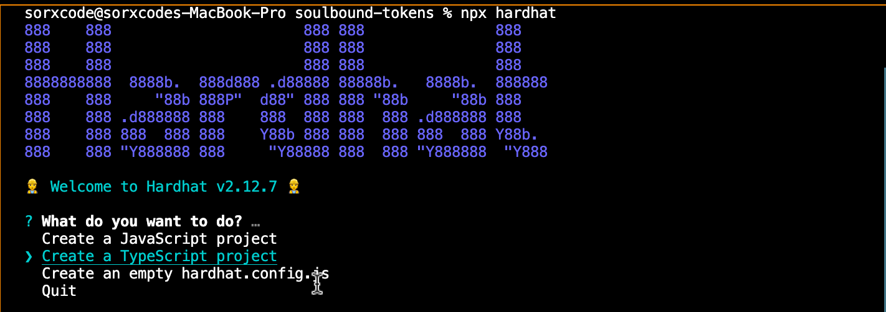
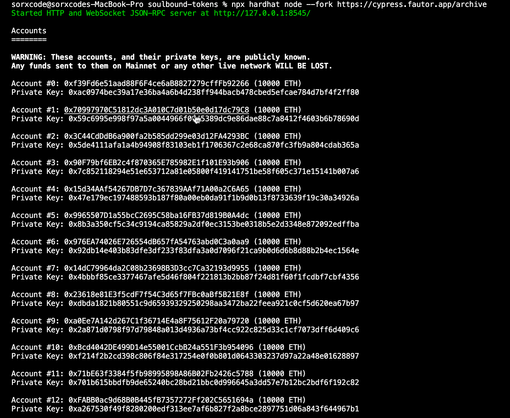

# 소개

이번 장에서는 [Hardhat](https://hardhat.org/)을 사용하여 Klaytn Baobab 네트워크에 Soulbound 토큰을 배포하는 과정을 안내해 드리겠습니다.

Hardhat은 다음을 도와줄 스마트 컨트랙트 개발 환경입니다:
* 스마트 컨트랙트를 개발하고 컴파일합니다.
* 스마트 컨트랙트와 dApps를 디버그, 테스트, 배포합니다.

Soul-bound 토큰(SBTs) 은 전송할 수 없는 NFTs(비대체 가능 토큰) 입니다. 즉, 한 번 획득하면 다른 사용자에게 팔거나 전송할 수 없습니다. SBT에 대해 더 자세히 알고 싶으시면, 어떻게 작동하는지 및 사용 사례에 대해 Vitalik Buterin이 발표한 이 [참고 문서](https://vitalik.ca/general/2022/01/26/soulbound.html)를 확인하실 수 있습니다.

이 가이드를 마치면 다음을 수행할 수 있게 됩니다:
* Klaytn에서 Harthat 프로젝트 설정.
* 간단한 Soul-bound 토큰 생성.
* Hardhat을 사용하여 스마트 컨트랙트 컴파일.
* Hardhat을 사용하여 스마트 컨트랙트 테스트, 배포 및 상호 작용.
* Hardhat의 포크 기능 탐색.


# 사전 요구 사항

이 튜토리얼을 따르려면 아래 조건이 필요합니다:

* 코드 에디터: VS-Code와 같은 소스 [코드 에디터](https://code.visualstudio.com/download).
* [Metamask](https://docs.klaytn.foundation/dapp/tutorials/connecting-metamask#install-metamask): 컨트랙트를 배포하고, 트랜잭션에 서명하고, 컨트랙트와 상호 작용하는 데 사용됩니다.
* RPC Endpoint: 지원되는 [Endpoint Providers](https://docs.klaytn.foundation/content/dapp/json-rpc/public-en) 중 하나에서 이를 얻을 수 있습니다.
* [Faucet](https://baobab.wallet.klaytn.foundation/faucet)에서 테스트 KLAY: 충분한 KLAY로 계정을 충전합니다.
* [NodeJS 및 NPM](https://nodejs.org/en/)

# 개발 환경 설정

Hardhat을 사용하기 위해서는 개발 환경을 설정하고 Hardhat을 설치해야 합니다. 다음 단계로 이 작업을 수행해봅시다:

**1 단계**: 프로젝트 디렉토리 생성

```bash
mkdir soulbound-tokens
cd soulbound-tokens
```

**2 단계**: npm 프로젝트 초기화

터미널에 다음 명령어를 붙여넣어 package.json 파일을 생성하세요.

```bash
npm init -y
```

**3 단계**: Hardhat과 기타 종속성 설치:

* Hardhat을 설치하려면 아래의 코드를 터미널에 붙여넣으세요.

```bash
npm install --save-dev hardhat
```

* 다른 의존성을 설치하려면 아래 코드를 터미널에 붙여넣으세요.

```bash
npm install dotenv @nomicfoundation/hardhat-toolbox @klaytn/contracts
```

> 참고: 이것은 이 프로젝트에 필요한 다른 의존성을 설치합니다. `hardhat`, `hardhat-toolbox`, `klaytn/contract`, `dotenv` 등이 포함됩니다.


**4 단계**: Hardhat 프로젝트 초기화:

아래 명령어를 실행하여 Hardhat 프로젝트를 시작하세요.

```bash
npx hardhat
```
이 가이드에서는 아래와 같이 typescript 프로젝트를 선택하게 될 것입니다:



Hardhat프로젝트를 초기화한 후 현재 디렉토리에는 다음과 같은 내용이 포함되어야 합니다:

**contracts/** – 이 폴더에는 스마트 컨트랙트 코드가 포함되어 있습니다.

**scripts/** – 이 폴더에는 블록체인 네트워크에 컨트랙트를 배포하는 코드가 포함되어 있습니다.

**test/** – 이 폴더에는 스마트 컨트랙트를 테스트하는 모든 유닛 테스트가 포함되어 있습니다.

**hardhat.config.ts** – 이 파일에는 Hardhat의 작동과 소울 바운드 토큰의 배포에 중요한 환경 설정이 포함되어 있습니다.

**5 단계**: .env 파일을 생성합니다.

이제 프로젝트 폴더에 .env 파일을 생성하세요. 이 파일은 .env 파일에서 process.env로 환경 변수를 로드하는 데 도움이 됩니다.

* 터미널에 다음 명령어를 붙여넣어 .env 파일을 생성하세요.

```bash
touch .env
```

* 파일을 생성한 후, .env 파일을 다음과 같이 구성합시다:

```js
 KLAYTN_BAOBAB_URL= "Your Baobab RPC link"
 PRIVATE_KEY= "your private key copied from MetaMask wallet"
```

**6 단계**: Hardhat 설정하기

다음과 같은 환경 설정으로 `hardhat.config.ts` 파일을 수정하세요:

```js
require("@nomicfoundation/hardhat-toolbox");
require('dotenv').config()


module.exports = {
  solidity: "0.8.17",
  networks: {
    baobab: {
      url: process.env.KLAYTN_BAOBAB_URL || "",
      gasPrice: 250000000000,
      accounts:
        process.env.PRIVATE_KEY !== undefined ? [process.env.PRIVATE_KEY] : [],
    }
  }
};

```

이제 개발 환경이 모두 설정되었으므로, 소울 바운드 토큰 스마트 컨트랙트를 작성해봅시다.

# SBT 스마트 컨트랙트 생성

이번 장에서는 커뮤니티에서 검증된 코드의 견고한 기반 위에 구축된 안전한 스마트 컨트랙트 개발을 위한 라이브러리인 [Klaytn 컨트랙트](https://github.com/klaytn/klaytn-contracts)를 사용하게 됩니다. Klaytn 컨트랙트는 오픈 제플린 컨트랙트으로부터 포크한 라이브러이입니다.

> 참고: `개발 환경 설정` 장의 **3 단계**에서 이미 이 라이브러리를 설치했습니다.

**1 단계**: 탐색기 창에서 contracts 폴더를 선택하고, 새 파일 버튼을 클릭하여 `SBT.sol`이라는 새 파일을 생성합니다.

**2 단계**: 파일을 열고 아래의 코드를 붙여넣습니다:

```js
// SPDX-License-Identifier: MIT
pragma solidity ^0.8.7;

import "@klaytn/contracts/KIP/token/KIP17/KIP17.sol";
import "@klaytn/contracts/utils/Counters.sol";
import "@klaytn/contracts/access/Ownable.sol";

contract SoulBoundToken is KIP17, Ownable {
    using Counters for Counters.Counter;

    Counters.Counter private _tokenIdCounter;

    constructor() KIP17("SoulBoundToken", "SBT") {}

    function safeMint(address to) public onlyOwner {
        uint256 tokenId = _tokenIdCounter.current();
        _tokenIdCounter.increment();
        _safeMint(to, tokenId);
    }


    function _beforeTokenTransfer(address from, address to, uint256) pure override internal {
        require(from == address(0) || to == address(0), "This a Soulbound token. It cannot be transferred.");
    }

    function _burn(uint256 tokenId) internal override(KIP17) {
        super._burn(tokenId);
    }
}
```

**Code Walkthrough**

This is your smart contract. **line 1** shows that Hardhat uses the Solidity version 0.8.7 or greater. Other than that, it imports KIP17.sol and other supporting contracts. From **lines 6-12**, a smart contract that inherits KIP17 is been created. Also, the token name and symbol was passed in the constructor.

As you can see in the code above, the token name and symbol have been set to **SoulBoundToken** and **SBT** respectively. You can change the token name and symbol to anything you desire.

One major thing in this contract is that it prohibits token transfer, which makes the issued tokens soulbond.

# Testing SBT Smart Contract

In this section, we would be testing some of our contract functionalities.

**Step 1**: In the Explorer pane, select the test folder and click the New File button to create a new file named `sbtTest.ts`

**Step 2**: Copy the code below in the `sbtTest.ts` file.

```js
// This is an example test file. Hardhat will run every *.ts file in `test/`,
// so feel free to add new ones.

// Hardhat tests are normally written with Mocha and Chai.

// We import Chai to use its asserting functions here.
const { expect } = require("chai");

// We use `loadFixture` to share common setups (or fixtures) between tests.
// Using this simplifies your tests and makes them run faster, by taking
// advantage of Hardhat Network's snapshot functionality.
const { loadFixture } = require("@nomicfoundation/hardhat-network-helpers");

// `describe` is a Mocha function that allows you to organize your tests.
// Having your tests organized makes debugging them easier. All Mocha
// functions are available in the global scope.
//
// `describe` receives the name of a section of your test suite, and a
// callback. The callback must define the tests of that section. This callback
// can't be an async function.
describe("Token contract", function () {
  // We define a fixture to reuse the same setup in every test. We use
  // loadFixture to run this setup once, snapshot that state, and reset Hardhat
  // Network to that snapshot in every test.
  async function deployTokenFixture() {
    // Get the ContractFactory and Signers here.
    const sbt = await ethers.getContractFactory("SoulBoundToken");
    const [owner, addr1, addr2] = await ethers.getSigners();

    // To deploy our contract, we just have to call Token.deploy() and await
    // its deployed() method, which happens onces its transaction has been
    // mined.
    const sbtContract = await sbt.deploy();

    await sbtContract.deployed();

    // Fixtures can return anything you consider useful for your tests
    return { sbtContract, owner, addr1, addr2 };
  }

  // You can nest describe calls to create subsections.
  describe("Deployment", function () {
    // `it` is another Mocha function. This is the one you use to define each
    // of your tests. It receives the test name, and a callback function.
    //
    // If the callback function is async, Mocha will `await` it.
    it("Should mint SBT to owner", async function () {
      const { sbtContract, owner } = await loadFixture(deployTokenFixture);
      const safemint = await sbtContract.safeMint(owner.address);
      expect(await sbtContract.ownerOf(0)).to.equal(owner.address);
    });
  });

  describe("Transactions", function () {
    it("Should prohibit token transfer using transferFrom", async function () {
      const { sbtContract, owner, addr1 } = await loadFixture(
        deployTokenFixture
      );

      const safemintTx = await sbtContract.safeMint(owner.address);

      // prohibit token transfer of token id (0) from owner to addr1
      await expect(
        sbtContract.transferFrom(owner.address, addr1.address, 0)
      ).to.be.reverted;
  });

  it("Should prohibit token transfer using safeTransferFrom", async function () {
    const { sbtContract, owner, addr1 } = await loadFixture(
      deployTokenFixture
    );

    const safemintTx = await sbtContract.safeMint(owner.address);

    // prohibit token transfer of token id (0) from owner to addr1
    await expect(sbtContract['safeTransferFrom(address,address,uint256)'](
      owner.address,
      addr1.address,
      0 
  )).to.be.reverted;
});


});

})
```

In the code you just copied, line 7 & 12 shows you imported expect from [Chai](https://www.chaijs.com/api/bdd/) and [loadFixture](https://hardhat.org/tutorial/testing-contracts#reusing-common-test-setups-with-fixtures) from hardhat-network-helpers.

The tests above check the following:

* Is the owner of a particular token id the same as who it was minted to?
* Did it prohibit transfer of tokens between accounts?

**Step 3**: To run your test, run the command below:

```bash
npx hardhat test test/sbtTest.ts 
```


For more in-depth guide on testing, please check [Hardhat testing](https://hardhat.org/hardhat-runner/docs/guides/test-contracts).

# Deploying the smart contract

Scripts are JavaScript/Typescript files that help you deploy contracts to the blockchain network. In this section, you will create a script for the smart contract.

**Step 1**: In the Explorer pane, select the “scripts” folder and click the New File button to create a new file named `sbtDeploy.ts`.

**Step 2**: Copy and paste the following code inside the file.

> Note: input your MetaMask wallet address in the `deployerAddr` variable.

```js
import { ethers } from "hardhat";

async function main() {

    const deployerAddr = "Your Metamask wallet address";
    const deployer = await ethers.getSigner(deployerAddr);

    console.log(`Deploying contracts with the account: ${deployer.address}`);
    console.log(`Account balance: ${(await deployer.getBalance()).toString()}`);

  const sbt = await ethers.getContractFactory("SoulBoundToken");
  const sbtContract = await sbt.deploy();


  await sbtContract.deployed();

console.log(`Congratulations! You have just successfully deployed your soul bound tokens.`);
console.log(`SBT contract address is ${sbtContract.address}. You can verify on https://baobab.scope.klaytn.com/account/${sbtContract.address}`);
}

// We recommend this pattern to be able to use async/await everywhere
// and properly handle errors.
main().catch((error) => {
  console.error(error);
  process.exitCode = 1;
});
```

**Step 3**: In the terminal, run the following command which tells Hardhat to deploy your SBT token on the Klaytn Test Network (Baobab)

```bash
npx hardhat run scripts/sbtDeploy.ts --network baobab
```


**Step 4**: Open [Klaytnscope](https://baobab.scope.klaytn.com/) to check if the SBT token has been deployed successfully.

**Step 5**: Copy and paste the deployed contract address in the search field and press Enter. You should see the recently deployed contract.


# Hardhat Forking

Hardhat provides developers the functionality of simulating the mainnet (at any given block) to a local development network. One of the major benefit of this feature is that it enables developers to interact with deployed contract and also write test for complex cases.

For this feature to work effectively, you need to connect to an archive node. You can read more about this feature [here](https://hardhat.org/hardhat-network/docs/guides/forking-other-networks#forking-other-networks)

## Forking Mainnet
Now that we have our Hardhat project set up let’s fork the Klaytn Mainnet using Hardhat.  Open your terminal and run this command

```bash
npx hardhat node --fork <YOUR ARCHIVE NODE URL>

npx hardhat node --fork https://archive-en.cypress.klaytn.net
```
You can also configure `hardhat.config.ts` - Hardhat Network to always do this:

```
networks: {
  hardhat: {
    forking: {
      url: "<YOUR ARCHIVE NODE URL>",
    }
  }
}
```

**Output**



After successfully running this command, your terminal looks like the above image.  You'll have 20 development accounts that are pre-funded with 10,000 test tokens.


The forked chain's RPC server is listening at `http://127.0.0.1:8545/`.  You can verify the forked network by querying the latest block number. Let's try to make a cURL to the RPC to get the block number.  Open a new terminal window and use the following command:

```bash
curl --data '{"method":"eth_blockNumber","params":[],"id":1,"jsonrpc":"2.0"}' -H "Content-Type: application/json" -X POST localhost:8545 
```

**Output**


The output is an hexadecimal as seen above. To get the block number from the hex, convert the hex to a decimal using this [tool](https://www.rapidtables.com/convert/number/hex-to-decimal.html). You should get the latest block number from the time you forked the network. You can confirm the block number on [klaytnscope](https://scope.klaytn.com/).

## Forking at a Block
With hardhat, you can fork the mainnet at a particular block.  In that case, let’s fork the chain at block number `105701850`.

```bash
npx hardhat node --fork <YOUR ARCHIVE NODE URL> --fork-block-number 105701850

npx hardhat node --fork https://archive-en.cypress.klaytn.net --fork-block-number 105701850
```

To confirm the forked chain at the stated block, open a new terminal window and use the following command:

```bash
curl --data '{"method":"eth_blockNumber","params":[],"id":1,"jsonrpc":"2.0"}' -H "Content-Type: application/json" -X POST localhost:8545 
```


The output returns hexadecimal which when converted using this [tool](https://www.rapidtables.com/convert/number/hex-to-decimal.html) should be equal to `105701850`.


For more in-depth guide on Hardhat, please refer to [Hardhat Docs](https://hardhat.org/hardhat-runner/docs/getting-started). Also, you can find the full implementation of the code for this guide on [GitHub](https://github.com/klaytn/examples/tree/main/hardhat/soulbound-tokens)
